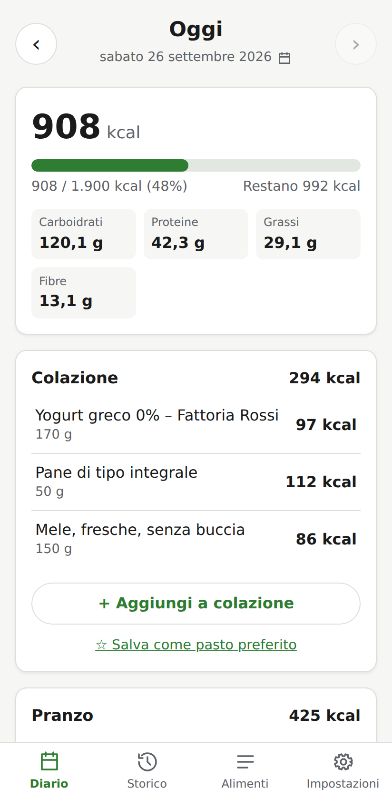
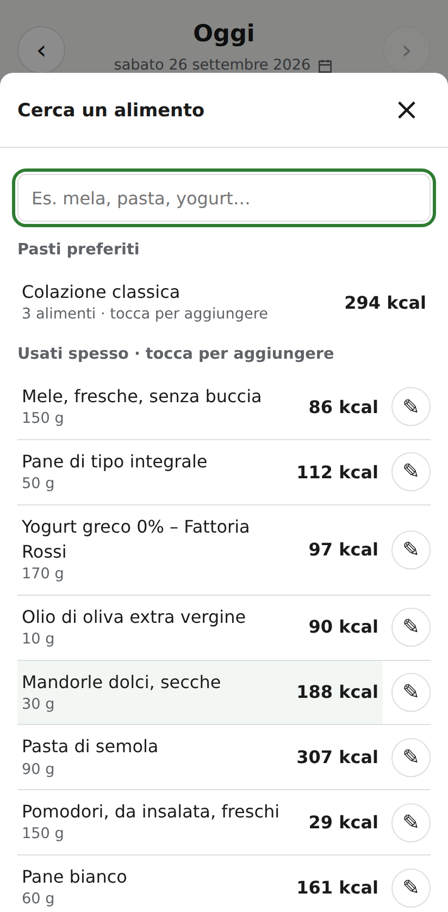
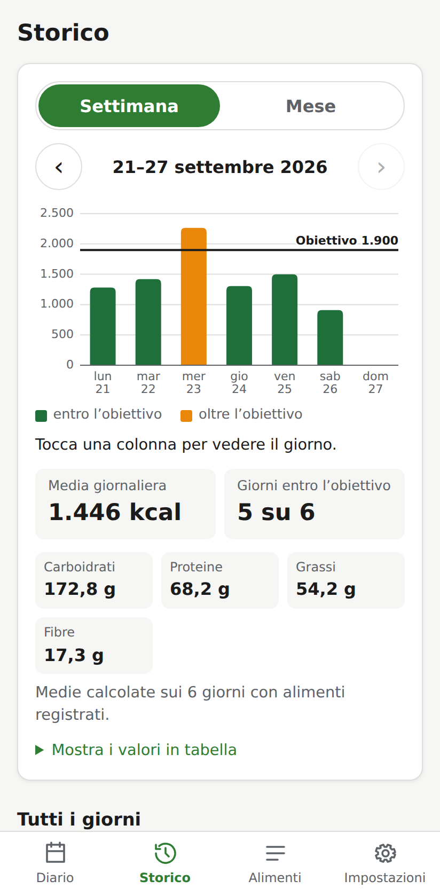
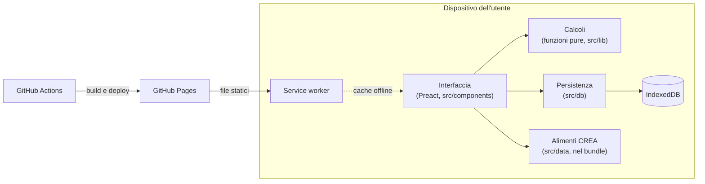

# MyDiet

**Diario alimentare per il telefono: registra cosa mangi e calcola calorie e macronutrienti, senza account e senza server.**

[](https://github.com/modugnoclaudio/MyDiet/actions/workflows/deploy.yml)
[](https://www.typescriptlang.org/)
[](https://web.dev/explore/progressive-web-apps)

### 👉 Usala online: **https://modugnoclaudio.github.io/MyDiet/**

MyDiet è una Progressive Web App: si apre dal browser, si installa sulla schermata Home come un'app e funziona anche offline. Include 616 alimenti di base dalle tabelle di composizione **CREA**; gli altri (yogurt, dolci, formaggi di una certa marca…) li aggiungi tu con i valori dell'etichetta.

**I dati restano solo sul tuo dispositivo**: nessuna registrazione, nessun invio a server esterni.

<p>
  
  
  
</p>

---

## Installarla sul telefono

| Telefono | Come fare |
|---|---|
| **Android** (Chrome) | Apri il link → menu **⋮** → **Aggiungi a schermata Home** (o **Installa app**) |
| **iPhone** (Safari) | Apri il link → **Condividi** → **Aggiungi alla schermata Home** |

Gli aggiornamenti arrivano da soli: basta chiudere e riaprire l'app.

---

## Cosa fa

| Funzione | Descrizione |
|---|---|
| **Diario giornaliero** | Alimenti divisi per pasto (colazione, pranzo, cena, spuntino), con i totali di kcal, carboidrati, proteine, grassi e fibre per pasto e per giorno |
| **Obiettivo di kcal** | Obiettivo giornaliero impostabile, con barra di avanzamento e kcal rimanenti |
| **Alimenti di base** | 616 alimenti dalle tabelle CREA (frutta, verdura, legumi, cereali, carne, pesce, uova, latte e yogurt, oli), con controllo di coerenza dei valori |
| **Alimenti personali** | Nome, marca facoltativa e valori per 100 g dall'etichetta; l'app avvisa se le kcal non tornano con i nutrienti |
| **Quantità in unità** | Oltre ai grammi: "3 uova", "1 porzione", o unità tue come "1 vasetto = 125 g" |
| **Preferiti** | Alimenti *usati spesso* da aggiungere con un tocco e *pasti preferiti* (es. "Colazione classica") da inserire tutti insieme |
| **Andamento** | Grafico delle kcal per settimana o per mese, con linea dell'obiettivo, medie giornaliere e tabella dei valori |
| **Backup** | Esporta tutti i dati in un file JSON e reimportali, ad esempio quando cambi telefono |

---

## Privacy e sicurezza

- Tutti i dati (diario, alimenti, impostazioni) sono salvati **nel browser del dispositivo** (IndexedDB). Nessuno, nemmeno l'autore, può vederli.
- L'app non fa richieste verso altri siti: lo impone una Content Security Policy che permette solo lo stesso indirizzo dell'app.
- Se cancelli i dati del browser o cambi telefono i dati si perdono: per questo c'è il **backup**, e l'app ricorda di farlo se l'ultimo ha più di 30 giorni.

Dettagli in [docs/sicurezza.md](docs/sicurezza.md).

---

## Architettura



Non c'è backend: GitHub Pages serve solo i file statici dell'app. La logica di calcolo sta in funzioni pure coperte da test, i componenti la usano senza duplicarla, e solo i moduli di `src/db/` accedono a IndexedDB.

---

## Sviluppo

Prerequisiti: **Node.js 22** (≥ 22.18 per `npm run dati:crea`).

```bash
git clone https://github.com/modugnoclaudio/MyDiet.git
cd MyDiet
npm install
npm run dev
```

| Comando | Descrizione |
|---|---|
| `npm run dev` | Dev server con ricaricamento automatico |
| `npm test` | Esegue i test (Vitest) |
| `npm run lint` | ESLint su tutto il progetto |
| `npm run typecheck` | Solo controllo dei tipi |
| `npm run build` | Typecheck e build di produzione in `dist/` |
| `npm run preview` | Serve la build di produzione in locale |
| `npm run dati:crea` | Riscarica dalle tabelle CREA gli alimenti di base |

Prima di ogni commit devono passare `npm run lint`, `npm test` e `npm run build`. Il deploy su GitHub Pages parte da solo a ogni push su `main`; sulle pull request il workflow esegue solo lint, test e build.

Le convenzioni del progetto (funzioni pure testate in `src/lib/`, migrazioni del database, testi in italiano, regole di sicurezza) sono descritte in [CLAUDE.md](CLAUDE.md).

---

## Struttura del progetto

```
MyDiet/
├── src/
│   ├── main.tsx        # Avvio dell'app e registrazione del service worker
│   ├── components/     # Componenti dell'interfaccia (Preact)
│   ├── lib/            # Calcoli: funzioni pure, ognuna con il suo *.test.ts
│   ├── db/             # IndexedDB: schema, migrazioni, lettura e scrittura
│   └── data/           # Alimenti di base CREA (generati da script)
├── scripts/            # Importazione dati CREA e Content Security Policy
├── docs/               # Verifica dei dati CREA, sicurezza, immagini
├── public/             # Icona dell'app
└── .github/            # Workflow di deploy e Dependabot
```

---

## Dati nutrizionali

I valori degli alimenti di base provengono dalle **Tabelle di composizione degli alimenti** del CREA e vengono importati da uno script, mai modificati a mano. Ogni alimento supera un controllo di coerenza tra kcal e nutrienti (metodo di Southgate); un campione è stato confrontato con i dati USDA. La verifica completa è in [docs/verifica-dati-crea.md](docs/verifica-dati-crea.md).

I valori sono indicativi e non sostituiscono il parere di un medico o di un nutrizionista.

---

## Limiti

- **Un solo dispositivo**: i dati non si sincronizzano tra telefono e computer; per spostarli si usa il backup.
- **Nessun codice a barre**: i prodotti confezionati vanno inseriti a mano con i valori dell'etichetta.
- **Solo macronutrienti**: niente vitamine, minerali o sodio.
- Gli alimenti di base non comprendono dolci, formaggi e salumi, che variano molto da marca a marca.

---

## Crediti

- Valori nutrizionali degli alimenti di base. **Fonte: CREA Centro di ricerca Alimenti e Nutrizione – [www.alimentinutrizione.it](https://www.alimentinutrizione.it)**
- Realizzata con [Vite](https://vite.dev/), [Preact](https://preactjs.com/), [idb](https://github.com/jakearchibald/idb) e [vite-plugin-pwa](https://vite-pwa-org.netlify.app/).
